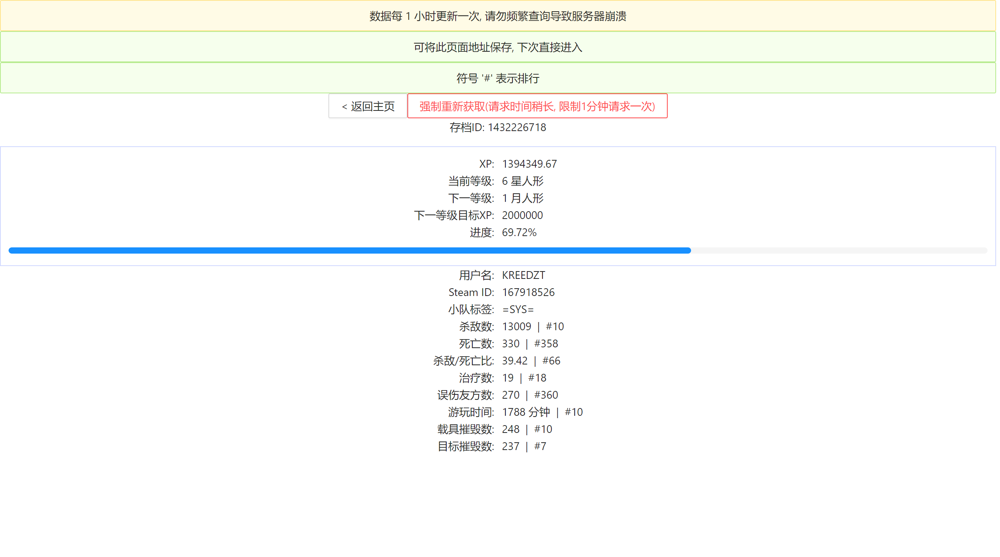

# RWR GFL 存档数据查询


## 成品展示



## 开发

> 该项目依赖后端运行, 具体请参考后端的开发操作: https://github.com/Kreedzt/rwr-profile-server

该项目依赖 [Nodejs](https://nodejs.org/en/) 进行开发

首先安装依赖包, 该项目采用 `pnpm` 进行包管理

安装 `pnpm` 命令:

```sh
npm i -g pnpm
```

安装依赖包:

```sh
pnpm i
```

启动开发环境

```sh
pnpm dev
```

启动后会在终端输出本地端口, 使用浏览器访问即可

## 构建

该项目依赖 [Nodejs](https://nodejs.org/en/) 进行打包操作

首先安装依赖包, 该项目采用 `pnpm` 进行包管理

安装 `pnpm` 命令:

```sh
npm i -g pnpm
```

安装依赖包:

```sh
pnpm i
```

构建

```sh
pnpm build
```

执行后会在 `dist` 目录下生成打包后代码

## 特性

- XP Top 10 排行
- 用户名搜索
- 用户个人数据及排行

## 部署

见 [部署文档](https://github.com/Kreedzt/rwr-profile-stats/blob/master/DEPLOYMENT.md)

## 其他项目

- [RWR GFL 存档管理系统](https://github.com/Kreedzt/rwr-profile-web)
- [RWR GFL 存档管理服务](https://github.com/Kreedzt/rwr-profile-server)
- [RWR GFL 存档数据可视化](https://github.com/Kreedzt/rwr-profile-visualization)

## 协议

- [GPLv3](https://opensource.org/licenses/GPL-3.0)
